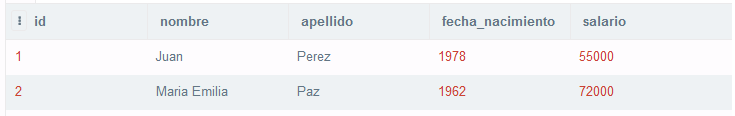

# SQL-Alkemy

## Tema 1 

### Ejercicio 1:

```sql
CREATE TABLE CURSO (
	codigo INT PRIMARY KEY NOT NULL,
  	nombre VARCHAR(25) NOT NULL,
  	descripcion VARCHAR(100),
  	turno VARCHAR(25) NOT NULL
);
```
### Ejercicio 2:

```sql
ALTER TABLE CURSO ADD cupo INT;
```
### Ejercicio 3:

```sql
INSERT INTO CURSO (codigo, nombre, descripcion, turno, cupo) 
VALUES (101, 'Algoritmos','Algoritmos y Estructuras de Datos','Mañana',35);
```
```sql
INSERT INTO CURSO (codigo, nombre, descripcion, turno, cupo) 
VALUES (102, 'Matemática Discreta','','Tarde',30);
```
### Ejercicio 4 

```sql
INSERT INTO CURSO (codigo, descripcion, turno, cupo) 
VALUES (109,'','Tarde',30);
```
#### Screenshot


### Ejercicio 5

```sql
INSERT INTO CURSO (codigo, nombre, descripcion, turno, cupo) 
VALUES (102, 'Programacion','','Tarde',20);
```
#### Screenshot


### Ejercicio 6

```sql
UPDATE CURSO SET cupo = 25;
```
### Ejercicio 7

```sql
DELETE FROM CURSO WHERE nombre = 'Algoritmos';
```

## Tema 3 
### Ejercicio 1

```sql
SELECT p.nombre , p.apellido, p.fecha_nacimiento
FROM profesor p ORDER by p.fecha_nacimiento Asc;
```
#### Screenshot


### Ejercicio 2

```sql
SELECT * FROM profesor p WHERE p.salario >= 65000;
```
#### Screenshot

### Ejercicio 3

```sql
SELECT * FROM profesor WHERE fecha_nacimiento BETWEEN '1980-01-01' and '1989-12-31';
```
#### Screenshot

### Ejercicio 4

```sql
SELECT * FROM profesor p LIMIT 5;
```
#### Screenshot


### Ejercicio 5

```sql
SELECT * FROM profesor p WHERE p.apellido LIKE 'P%'
```
#### Screenshot

### Ejercicio 6

```sql
SELECT * FROM profesor WHERE fecha_nacimiento 
BETWEEN '1980-01-01' and '1989-12-31' AND salario > 80000;
```
#### Screenshot
